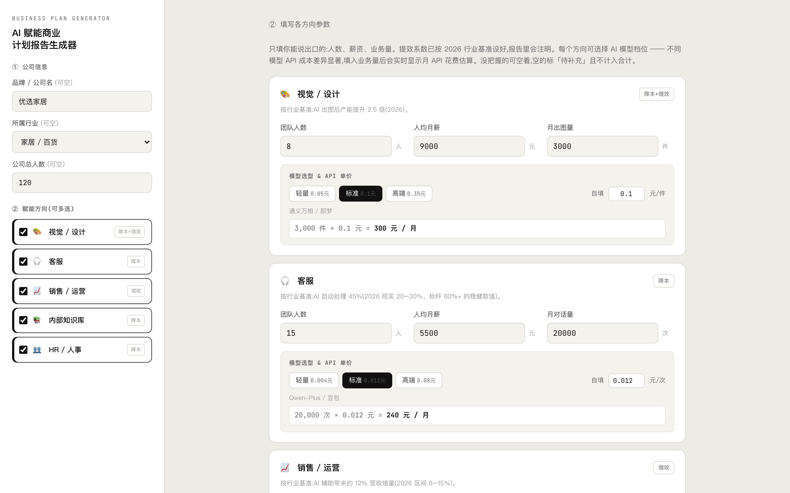
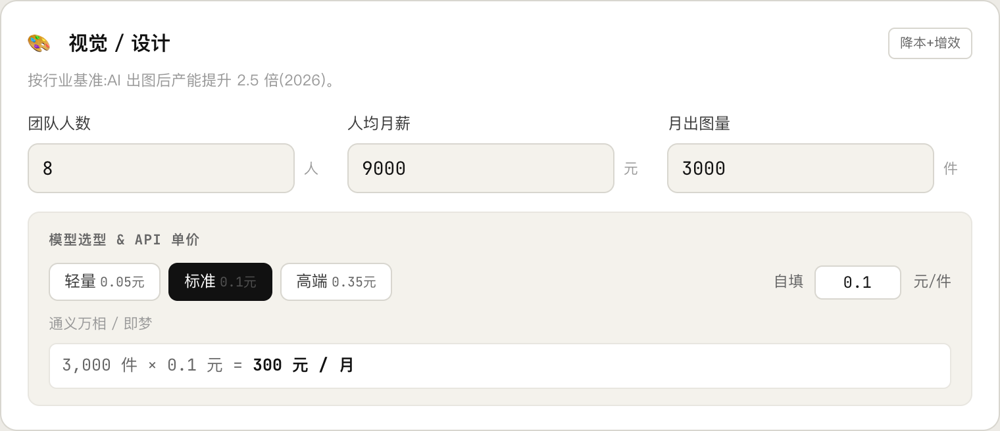
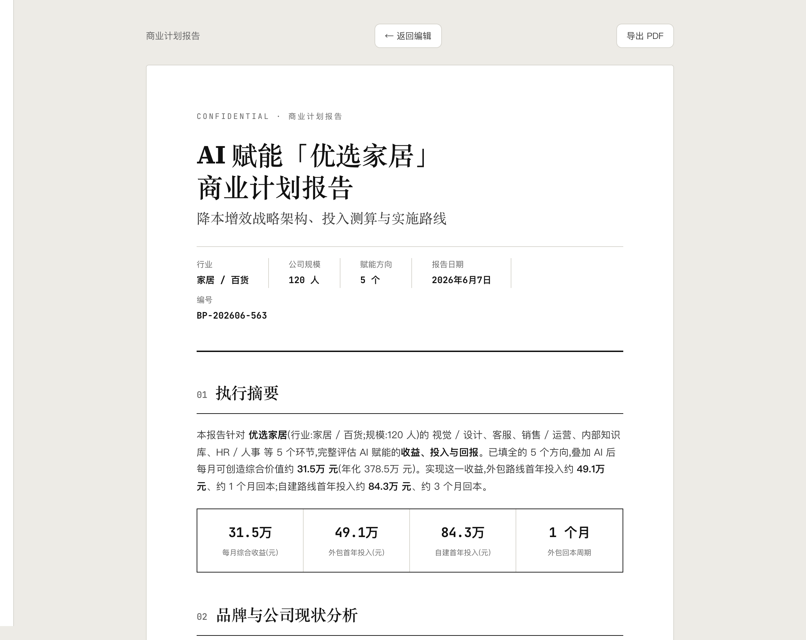
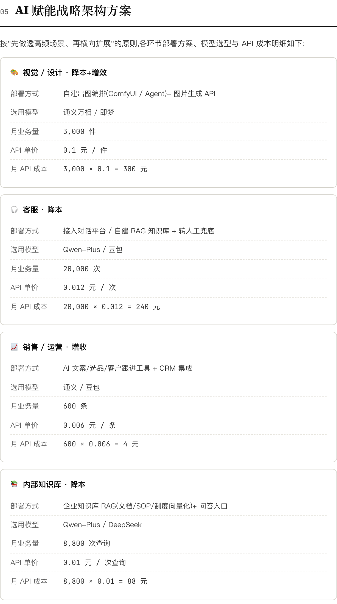
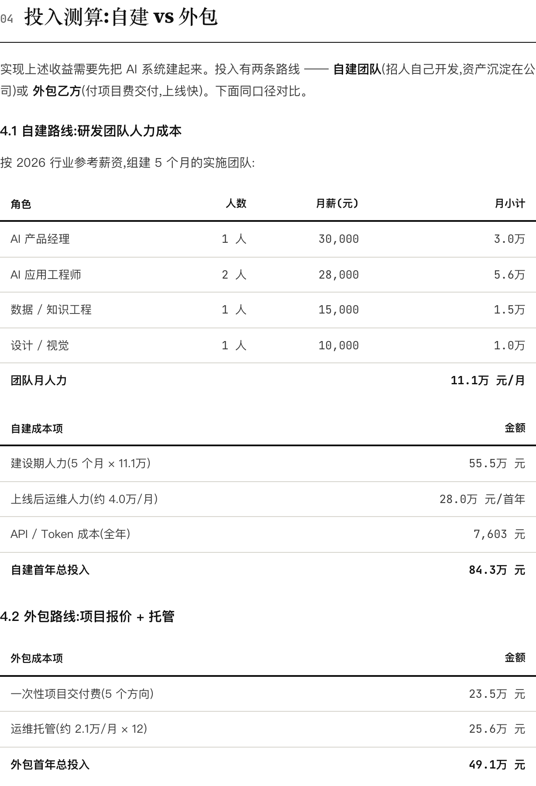

# AI 赋能商业计划报告生成器

> 面向中小电商企业的自助式 AI ROI 评估工具。填公司信息、选赋能方向、填几个真实数字，一键生成一份《AI 赋能 XX 品牌商业计划报告》，同时算清**收益（降本 + 增效）**与**投入（自建 vs 外包）**，可导出 PDF。

**在线体验 →** 克隆后直接浏览器打开 `index.html` 即用，无需安装任何依赖。

---

## 截图预览

### ① 填写参数 — 模型选型 & 实时 API 成本预估

每个赋能方向均内置三档模型可选（轻量 / 标准 / 高端），填入业务量后**实时显示月 API 花费公式**，也可自填单价：



---

### ② 模型档位特写 — 公式透明可追溯

`业务量 × 单价 = 月 API 成本` 实时联动，不同模型价差最高 50 倍，选对档位避免高估或低估：



---

### ③ 生成报告 — 执行摘要 & KPI 看板

一键生成投资备忘录风格报告，封面含行业、规模、方向数、日期、编号，执行摘要四格 KPI 一目了然：



---

### ④ 战略架构章节 — 每个方向模型 + API 明细

报告第 05 章逐方向列出：部署方式、**选用模型**、月业务量、**API 单价**、**月 API 成本公式**，数字可追溯：



---

### ⑤ 投入测算 — 自建 vs 外包双路线对比

同口径给出自建团队（人力 + 运维 + API）与外包乙方（交付费 + 托管）的首年总投入、回本周期、ROI：



---

## 核心功能

| 功能 | 说明 |
|------|------|
| **5 个赋能方向** | 视觉/设计、客服、销售/运营、内部知识库、HR/人事，可任意勾选 |
| **模型三档可选** | 每个方向轻量 / 标准 / 高端三档，对应国产轻量模型到 GPT-4o，价差最高 50 倍 |
| **实时 API 成本预估** | 填入业务量即刻显示 `数量 × 单价 = 月花费`，单价可自填覆盖 |
| **不编造数字** | 未填字段一律标「待补充」，不参与合计，报告数字 100% 来自用户输入 |
| **双视角输出** | 老板看收益回报，乙方/自己看部署投入成本 |
| **自建 vs 外包对比** | 团队规模随方向数自动缩放，给出两条路线的首年投入与回本周期 |
| **视觉双口径** | 同一套数据同时给出「降本（省人力成本）」和「增效（产能翻倍）」两种说法 |
| **PDF 导出** | 用 html2pdf.js，不走打印对话框，一键生成专业交付物 |

---

## 快速开始

```bash
# 无需安装、无需构建，直接打开即可
open index.html        # macOS
# 或双击 index.html 用浏览器打开
```

如需本地起服务（避免某些浏览器对本地文件的限制）：
```bash
python3 -m http.server 8080
# 浏览器访问 http://localhost:8080
```

---

## 使用流程

1. **左侧**填公司信息（品牌名 / 行业 / 总人数，均可空），勾选赋能方向
2. **右侧参数卡**填各方向的人数、薪资、业务量
3. 在「**模型选型 & API 单价**」区块选择模型档位，或自填单价；业务量一填，月 API 成本实时显示
4. 点「**生成商业计划报告 →**」
5. 查看报告，点「**导出 PDF**」获得正式交付物，或「**返回编辑**」调整参数

---

## 计算逻辑

提效系数按 **2026 年行业基准**内置，用户只需填人数 / 薪资 / 业务量：

| 方向 | 核心系数 | 收益口径 |
|------|----------|----------|
| 视觉 / 设计 | 产能提升 2.5 倍 | 降本（省人力）+ 增效（产能 ×2.5）双口径 |
| 客服 | AI 自动处理率 45% | 降本（等效减少人力投入）|
| 销售 / 运营 | AI 带来营收增量 12% | 增收（按毛利折算净价值）|
| 内部知识库 | 每次查询节省 6 分钟 | 降本（工时节省折算人力成本）|
| HR / 人事 | 可省 40% 事务人力 | 降本（等效人力成本）|

**投入侧**：自建团队规模随方向数缩放（1–2 个场景轻配，4+ 个场景重配）；外包报价 = 各方向交付费合计 + 运维托管（按 API 成本 + 收益的 5% × 1.3 估算）。

**ROI** = `(月收益 × 12 − 首年投入) / 首年投入 × 100%`

---

## 模型档位参考（2026 基准）

| 方向 | 轻量 | 标准（默认） | 高端 |
|------|------|------------|------|
| 视觉出图 | 即梦/万相 Lite · 0.05 元/件 | 通义万相/即梦 · 0.10 元/件 | Midjourney/Flux · 0.35 元/件 |
| 客服对话 | DeepSeek-V3/Qwen-Turbo · 0.004 元/次 | Qwen-Plus/豆包 · 0.012 元/次 | GPT-4o/Claude · 0.08 元/次 |
| 运营内容 | DeepSeek-V3/Qwen-Turbo · 0.002 元/条 | 通义/豆包 · 0.006 元/条 | GPT-4o/Claude · 0.04 元/条 |
| 知识库查询 | DeepSeek-V3/Qwen-Turbo · 0.003 元/次 | Qwen-Plus/DeepSeek · 0.01 元/次 | GPT-4o/Claude · 0.05 元/次 |
| HR 事务 | DeepSeek-V3/Qwen-Turbo · 0.003 元/件 | Qwen-Plus/DeepSeek · 0.01 元/件 | GPT-4o/Claude · 0.05 元/件 |

> 2026 年国产大模型 API 价格较 2025 年下降约 80%，不同模型价差可达 10–50 倍。单价均可自填覆盖，报告中完整展示计算公式。

---

## 文件结构

```
ai-roi-project/
├── index.html              ← 主程序（报告生成器，全部逻辑在此）
├── CLAUDE.md               ← 项目完整上下文（决策/计算逻辑/数据来源/待办）
├── README.md               ← 本文件
├── docs/
│   ├── decisions.md        ← 决策日志（为什么这么定）
│   ├── data-2026.md        ← 2026 数据基准与来源，复核清单
│   └── screenshots/        ← README 截图
└── legacy/
    ├── calculator-v3.html  ← 早期版：多团队降本增效测算器
    └── prd-v1.html         ← 早期版：交互式 PRD 文档
```

`index.html` 内部结构：

| 对象 / 函数 | 作用 |
|-------------|------|
| `SC` | 5 个方向的定义（名称 / 系数 / 部署方式 / 单价 / 报价 / 排期）|
| `TIERS` | 每个方向的三档模型选项（轻量 / 标准 / 高端）|
| `compute()` | 所有收益 + 投入计算逻辑 |
| `generate()` | 渲染报告 HTML（9 个章节）|
| `updateApiPreview()` | 实时更新 API 成本预估公式 |
| `val(id)` | 取值，空返回 null（「不编造」的关键）|

---

## 设计原则

- **不编造数字**：`val()` 空值返回 `null`，未填字段标「待补充」，不参与任何合计
- **单价透明**：API 成本 = 业务量 × 单价，公式在填表时实时显示，在报告中完整保留
- **系数藏后台**：产能倍数、AI 处理率等提效系数按行业基准内置，报告中注明，用户无需填写
- **口径诚实**：降本价值 = 等效人力成本，只有实际减员才转化为现金；报告中已加注脚说明
- **不伪造数据**：不接入企查查 / 工商数据，不生成任何真实公司的财务数字

---

## 适用场景

- AI 产品经理 / 顾问向客户做 AI 赋能评估提案
- 电商企业内部做 AI 项目立项 ROI 测算
- 乙方在谈判前快速出一份有数字支撑的商业计划

---

## 免责声明

报告中所有数字均为「基于用户输入 + 2026 公开行业基准的**估算**」，不构成投资承诺。API 单价以实际部署账单为准，模型能力与定价可能随时变化。
